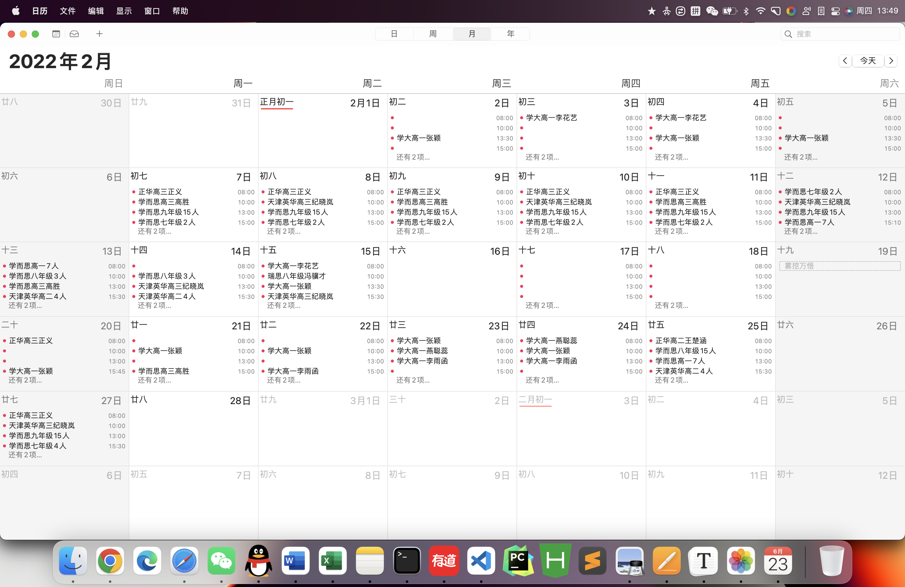
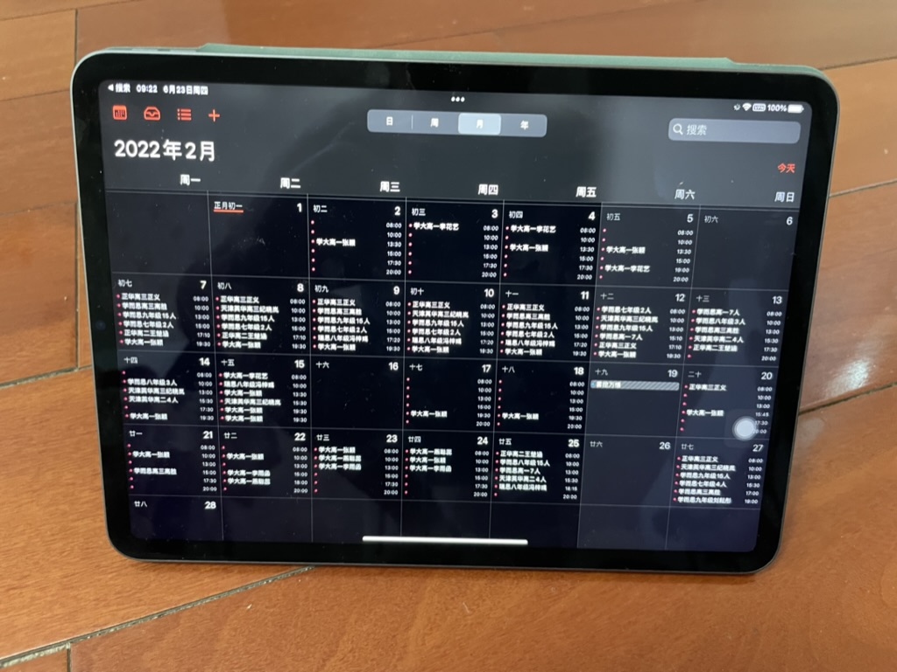
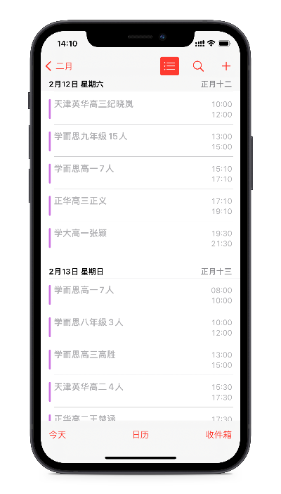
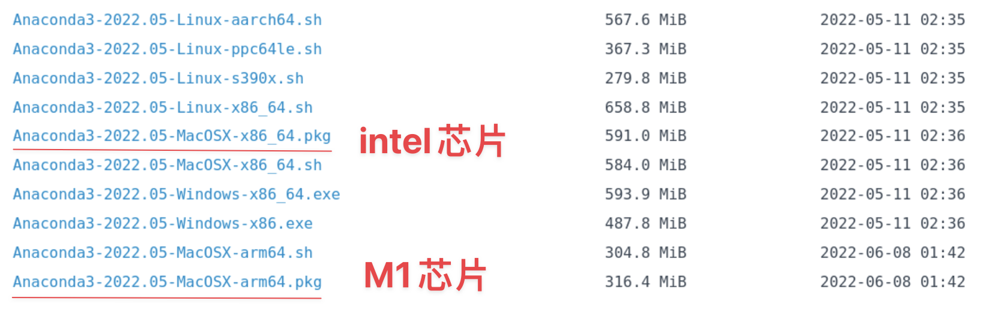
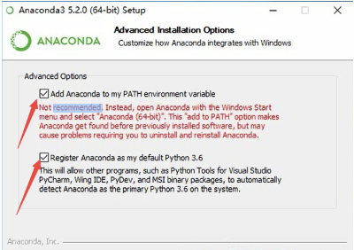
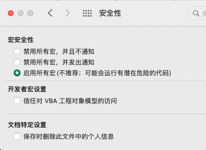
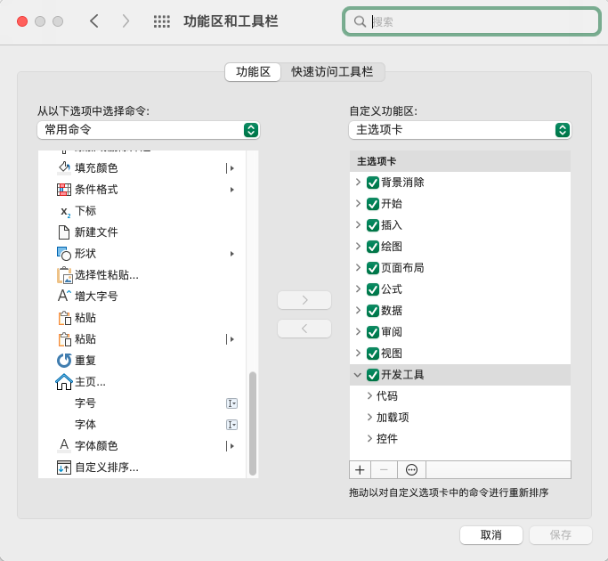

# 日历课表管理（mac - iphone）

> 项目是根据网上一些日历课表改写，默认每节课2小时，可以做到mac批量操作，手机同步增删改查操作。







## 安装依赖

### 安装python环境

[清华大学开源软件镜像站](https://mirrors.tuna.tsinghua.edu.cn/anaconda/archive/?C=M&O=A)

选择适合芯片的源



下载完成后，按照步骤安装

俩个勾一定要勾选



#### 测试python版本

```shell
python --version
```

出现版本号即成功

#### 进入icalendar文件夹

打开终端进入icalendar文件夹（假设放在downloads文件夹）

```powershell
cd Downloads/icalendar
```

或右键点击icalendar，点击```option```，点击```将icalendar拷贝为路径名称```

```powershell
cd /Users/joseph/Downloads/icalendar
```

绝对地址因人而异，要换成自己的路径

#### 安装依赖

```shell
pip install -r requirements.txt
```

如果失败，也可以按照这个步骤安装

```shell
pip install pandas
pip install xlrd==1.2.0
```

### 设置excel环境

打开文件夹内 ```calendar_excel_input.xlsx```

```command + ,``` 打开偏好设置，安全性，启用所有宏（不推荐：可能会运行有潜在危险的代码）



```command + ,``` 打开偏好设置，功能区，自定义功能区打开开发工具




## 如何使用icalendar

### 录入基础信息


#### 点击文件夹内xlsx文件（需要excel打开）
```calendar_excel_input.xlsx```

#### className: 

录入课程内容，格式没有要求

#### classTime: 

1~6选一个

根据以下内容大概选择一个数字即可，最终决定出现在日历的位置。***同一日期不要写入重复数字，课程会被覆盖***。

- 8点：1
- 10点：2
- 13点：3
- 15点：4
- 17-18点：5
- 19-20点：6

#### date: 

写入上课日期。注意格式 2022/6/3

#### startTime: 

13点, 13点10，15点30，15点45，17点05

注意：不要写13点半，13点5

#### endTime: 

自动生成 + 2小时。无需填写。

#### 点击按钮1

点击按钮并保存退出

### 进入icalendar文件夹

打开终端进入icalendar文件夹（假设放在downloads文件夹）

```powershell
cd Downloads/icalendar
```

或右键点击icalendar，点击```option```，点击```将icalendar拷贝为路径名称```

```powershell
cd /Users/joseph/Downloads/icalendar
```

绝对地址因人而异，要换成自己的路径

### 运行python文件

```powershell
python mainIcalendar.py
```

或者

```python
python excelReader.py
python outputics.py
```


### 运行ics文件

文件夹内出现文件```classIcalendar.ics```，双击后弹出日历应用，点击确定。和iPhone用同一个Apple ID可以在手机同步内容。

如果出现iphone长期不能同步，也可以隔空投送或者email给自己，用手机打开ics文件

